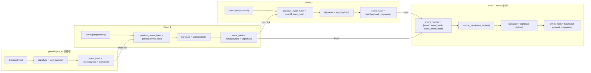
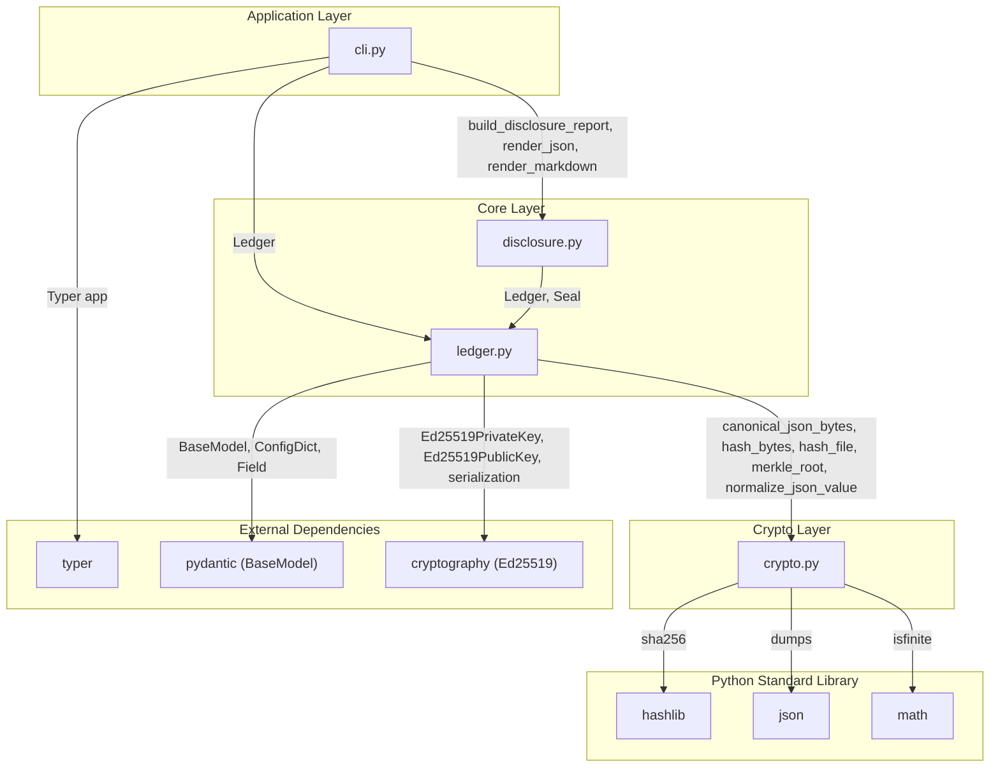

# Research Ledger 架構文件

> 本文件描述 Research Ledger 的整體架構，包含使用者工作流程、事件鏈結構，以及模組之間的依賴關係。

## 專案結構概覽

```
src/research_ledger/
├── __init__.py       — 套件版本定義
├── cli.py            — Typer CLI 進入點（指令：init, record, delete, rename, seal, verify, report, export-disclosure）
├── bundle.py         — 第三方 audit bundle 匯出
├── crypto.py         — 正規化 JSON、SHA-256 雜湊、串流式檔案雜湊、Merkle tree
├── disclosure.py     — AI 使用揭露報告產生器（JSON + Markdown）
└── ledger.py         — 核心 ledger 邏輯：Pydantic 資料模型、初始化、範圍宣告、記錄、驗證、封印
```

### 儲存結構

初始化後，工作區根目錄下會建立以下目錄結構：

```
.research-ledger/
  .gitignore           — 排除 private_key.pem
  ledger.json          — 後設資料（ledger_id、public key、key_id、schema version）
  genesis.json         — 已簽署的信任根事件
  scope.json           — 已簽署的第一次研究範圍宣告
  private_key.pem      — Ed25519 私鑰（機密，權限 0o600）
  events.jsonl         — 設計為 append-only 的事件紀錄
  snapshots/           — 不可變的檔案快照
  seals/               — Merkle-root 封印檔案
```

---

## 圖一：工作流程圖

下圖展示使用者透過 CLI 操作 Research Ledger 的完整流程。`init`、`record`、`delete`、`rename`、`seal` 會寫入 `.research-ledger/` 目錄內的相關檔案；`verify`、`report`、`export-disclosure` 主要讀取 ledger，並將結果輸出到終端或指定檔案。

```mermaid
graph TD
    subgraph INIT["init — 初始化"]
        A1["cli: init"] --> A2["Create .research-ledger/"]
        A2 --> A3["Generate Ed25519 key pair"]
        A3 --> A4["Write private_key.pem (0o600)"]
        A4 --> A5["Write ledger.json (metadata)"]
        A5 --> A6["Write genesis.json (signed trust root)"]
        A6 --> A7["Write scope.json (signed research boundary)"]
        A7 --> A8["Touch events.jsonl"]
    end

    subgraph RECORD["record — 記錄事件"]
        B1["cli: record --type TYPE path"] --> B2["Resolve path"]
        B2 --> B3["Validate workspace boundary"]
        B3 --> B4["Stream file to snapshots/"]
        B4 --> B5["hash_file: compute content_hash"]
        B5 --> B6["Build payload + sign (Ed25519)"]
        B6 --> B7["Compute event_hash"]
        B7 --> B8["Append event to events.jsonl"]
    end

    subgraph LIFECYCLE["delete / rename — 生命週期事件"]
        C1["cli: delete / rename"] --> C2["Resolve path + validate boundary"]
        C2 --> C3["Build lifecycle metadata"]
        C3 --> C4["Write synthetic snapshot (canonical JSON)"]
        C4 --> C5["Sign + compute event_hash"]
        C5 --> C6["Append lifecycle event to events.jsonl"]
    end

    subgraph SEAL["seal — 封印"]
        D1["cli: seal --label LABEL"] --> D2["Read all event_hashes from events.jsonl"]
        D2 --> D3["merkle_root(event_hashes)"]
        D3 --> D4["Sign seal payload + compute seal event_hash"]
        D4 --> D5["Write seal JSON to seals/"]
    end

    subgraph VERIFY["verify — 驗證"]
        E1["cli: verify"] --> E2["Check genesis signature + hash"]
        E2 --> E2a["Check scope declaration signature + hash"]
        E2a --> E3["Iterate events"]
        E3 --> E3a["Check sequence order"]
        E3 --> E3b["Check hash chain (previous_event_hash)"]
        E3 --> E3c["Verify Ed25519 signature"]
        E3 --> E3d["Verify event_hash"]
        E3 --> E3e["Verify snapshot content_hash"]
        E3 --> E3f["Detect working file drift"]
        E3a --> E4["Check all seals (signature + event_hash + merkle_root)"]
        E3b --> E4
        E3c --> E4
        E3d --> E4
        E3e --> E4
        E3f --> E4
        E4 --> E5["Return VerificationResult"]
    end

    subgraph DISCLOSURE["export-disclosure — 揭露報告"]
        F1["cli: export-disclosure --format FORMAT"] --> F2["build_disclosure_report(ledger)"]
        F2 --> F3["render_markdown / render_json"]
        F3 --> F4["Output to stdout or file"]
    end
```



---

## 圖二：事件鏈結構圖

Research Ledger 的核心安全機制是一條由密碼學保護的 **hash chain**。每個事件透過 `previous_event_hash` 連結至前一個事件，形成可偵測竄改的鏈狀結構。Seal 則對目前所有事件的 `event_hash` 計算 Merkle root，作為整體完整性的摘要指紋。沒有外部錨定時，seal 不單獨證明事件存在於某個外部可信時間點。

Genesis 之外，`scope.json` 是另一個 first-run governance artifact。它宣告這條 ledger 原本承諾覆蓋的研究筆記範圍、明確排除的路徑與記錄政策。Scope declaration 會被簽章與驗證，但它不是 hash chain 的第一個研究事件，也不代表範圍內所有檔案都已完整記錄。

### 簽章與雜湊計算規則

| 步驟 | 輸入 | 輸出 |
|------|------|------|
| 1. 建構 payload | 所有欄位（排除 `signature` 和 `event_hash`） | payload dict |
| 2. 簽章 | `canonical_json_bytes(payload)` → Ed25519 簽章 | `signature`（Base64） |
| 3. 計算 event_hash | `canonical_json_bytes(payload + signature)`（排除 `event_hash`） | `event_hash`（`sha256:...`） |



### Hash Chain 完整性保證

- **前向鏈結**：每個 event 的 `previous_event_hash` 指向前一個事件的 `event_hash`，任何中間事件被竄改都會造成簽章、事件雜湊或鏈結檢查失敗。
- **簽章來源綁定**：`signature` 涵蓋 payload 全部欄位（不含 `signature` 和 `event_hash`），在本地 key trust model 下可檢查事件是否由 ledger 綁定的 Ed25519 私鑰簽署。這不是法律上的不可否認性保證。
- **Event hash 完整性**：`event_hash` 涵蓋 payload + `signature`（不含 `event_hash` 本身），確保簽章也無法被替換。
- **Merkle seal**：對所有 `event_hash` 建構 Merkle tree，根雜湊值可作為整條事件鏈在某個本地里程碑的指紋；seal payload 也會以 ledger 綁定的 Ed25519 key 簽章，避免未持有私鑰者偽造本地 seal。

---

## 圖三：模組依賴圖

下圖展示 Research Ledger 各模組之間的 import 依賴關係，以及它們使用的外部套件。



### 模組職責摘要

| 模組 | 職責 | 主要匯出 |
|------|------|----------|
| `cli.py` | CLI 進入點，解析指令與參數 | `app`（Typer 應用程式） |
| `ledger.py` | 核心業務邏輯：初始化、範圍宣告、記錄、驗證、封印 | `Ledger`, `Event`, `Seal`, `GenesisEvent`, `ScopeDeclaration`, `LedgerMetadata`, `VerificationResult` |
| `disclosure.py` | AI 使用揭露報告的建構與渲染 | `build_disclosure_report`, `render_json`, `render_markdown` |
| `bundle.py` | 第三方 audit bundle 匯出 | `export_audit_bundle` |
| `crypto.py` | 密碼學基礎設施（純 stdlib 實作） | `canonical_json_bytes`, `hash_bytes`, `hash_file`, `merkle_root`, `normalize_json_value` |

### 設計原則

- **分層架構**：CLI → 核心邏輯 → 密碼學基礎設施，依賴方向單一且清晰。
- **crypto.py 零外部依賴**：僅使用 Python 標準函式庫，確保雜湊與正規化邏輯的可攜性與可審計性。
- **Ed25519 簽章由 ledger.py 管理**：透過 `cryptography` 套件實作金鑰生成、簽章與驗證，與底層雜湊計算分離。
- **Pydantic 資料模型**：所有事件與後設資料皆使用 `BaseModel` 定義，搭配 `extra="forbid"` 確保欄位嚴格一致。
